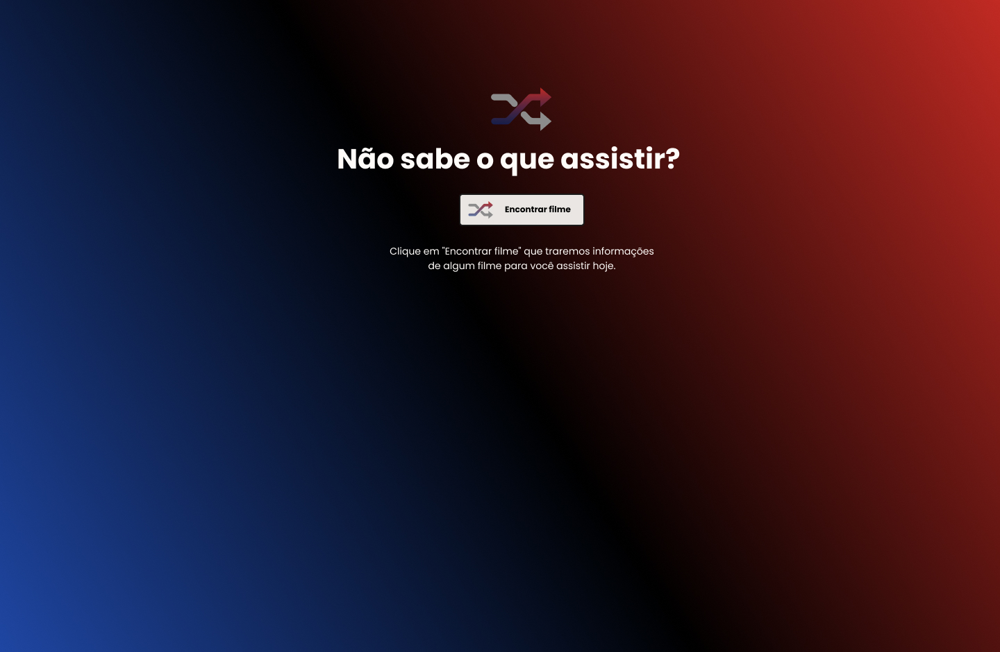
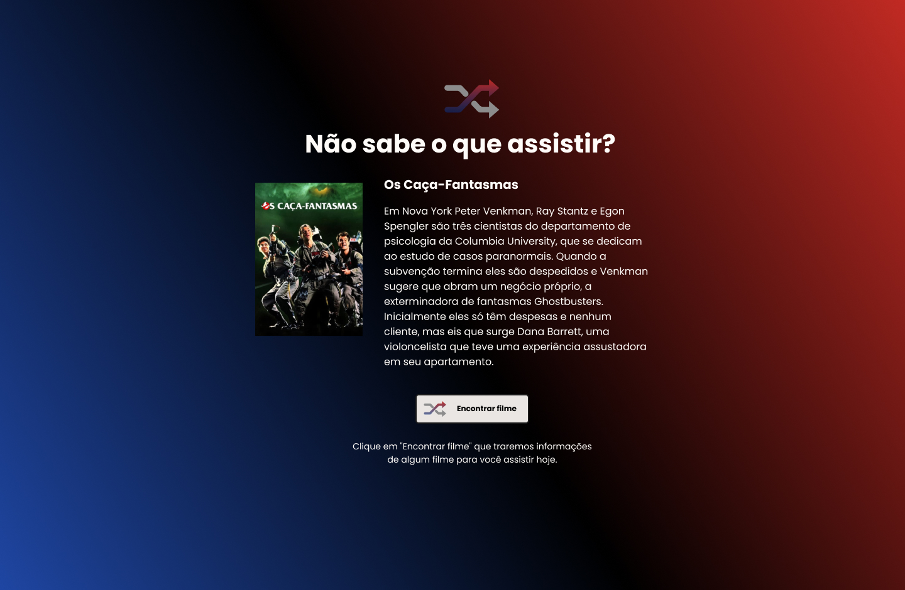
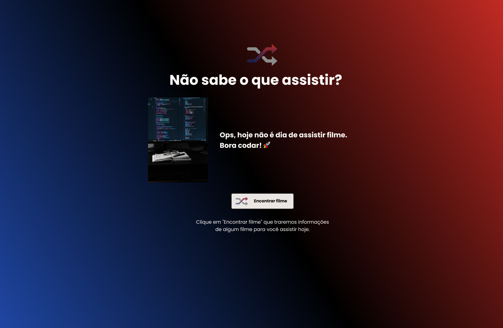
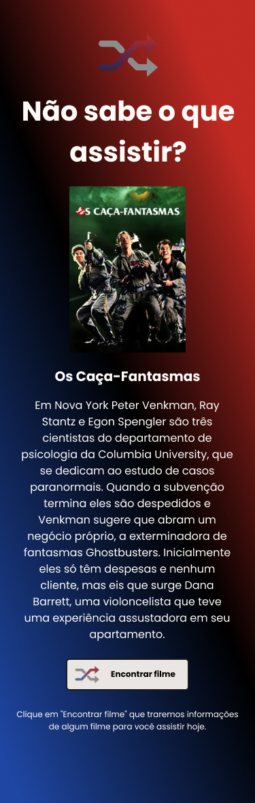

# discover-14-rocket-flix

  
  <h3>Default Return</h3>
  
  <h3>Not Found</h3>
  
  <h3>Mobile Version</h3>
  

 

**To make this code work its necessary to insert an API key from https://www.themoviedb.org/ in src/api.js **

Project developed with __HTML__ ,__CSS__ and __JS__

Challenge made for "Discover" / [@Rocketseat](https://github.com/Rocketseat)

By [Cristiano Alchaar da Silva](https://github.com/CristianoAlchaar)
